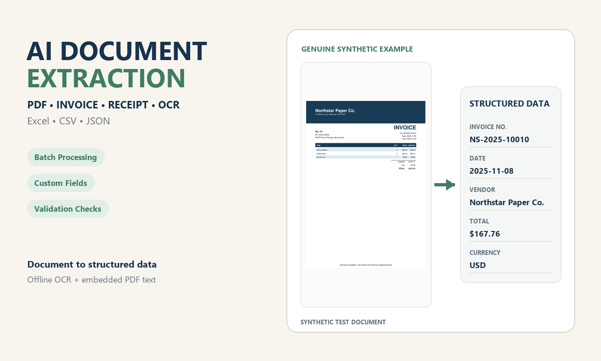
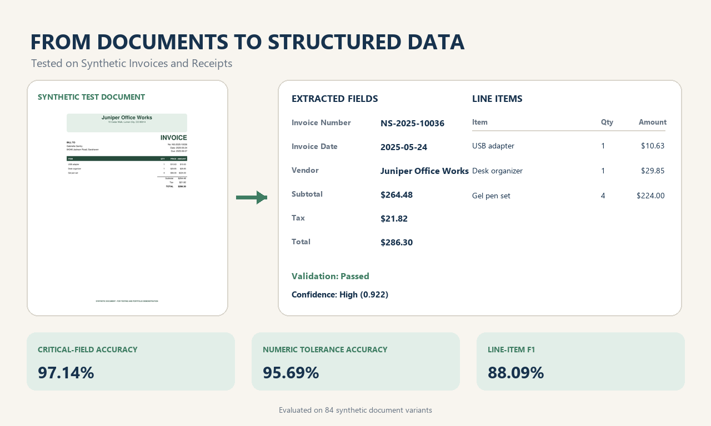
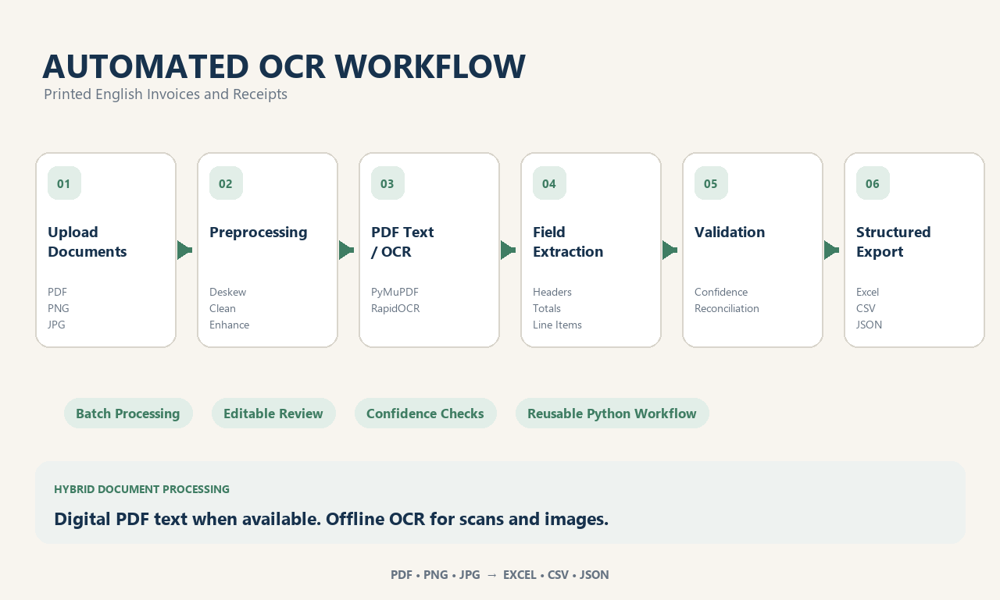

# AI Document Extraction & OCR Portfolio

An end-to-end portfolio project demonstrating how synthetic invoices and receipts can be transformed into structured Excel, CSV, and JSON data. All documents and identities are fictional.

## Current status

All six portfolio stages are complete. The project includes deterministic synthetic documents, hybrid embedded-text/OCR ingestion, structured extraction, validation, confidence, exports, a Streamlit review interface, final evaluation, and three verified Fiverr portfolio images.

## Stage 1 setup and commands

```powershell
python -m venv .venv
.\.venv\Scripts\python.exe -m pip install -r requirements.txt
.\.venv\Scripts\python.exe run_all.py --stage 1 --force
.\.venv\Scripts\python.exe run_all.py --stage 1 --quick --force
.\.venv\Scripts\python.exe run_all.py --stages extraction
.\.venv\Scripts\python.exe run_all.py --stages extraction --force
.\.venv\Scripts\streamlit.exe run app.py
.\.venv\Scripts\python.exe -m pytest
```

The normal dataset contains clean digital PDFs, PNG and JPG images with controlled degradation, and raster-only scanned PDFs. Exact nested truth is in `data/ground_truth/documents.json`; flat document and line-item tables are provided as CSV. Normal extraction does not access those truth files.

Digital PDFs use PyMuPDF embedded-text extraction when meaningful text is available. Images and raster PDFs use offline RapidOCR/ONNX Runtime with quality-sensitive preprocessing. Output files are written to `outputs/extracted`, including a formatted workbook with Documents, Line Items, Validation Warnings, and Run Summary sheets.

## Streamlit application

Launch locally:

```powershell
streamlit run app.py
```

The interface accepts one or many PDF, PNG, JPG, and JPEG files, previews the first page, runs the genuine hybrid pipeline, and displays batch metrics, extracted fields, editable line items, validation warnings, confidence components, optional raw text, and extraction evidence. Original extracted values are preserved separately from reviewed corrections. Revalidation uses reviewed values, and downloads are prepared in memory as JSON, document CSV, line-item CSV, warning CSV, and a four-sheet Excel workbook.

Existing synthetic samples can be selected without reading their ground truth.

### Genuine interface screenshots

- [Upload and preview](outputs/app_screenshots/01_upload_and_preview.png)
- [Extracted fields](outputs/app_screenshots/02_extracted_fields.png)
- [Line items and validation](outputs/app_screenshots/03_line_items_and_validation.png)
- [Batch results and exports](outputs/app_screenshots/04_batch_results_and_exports.png)

## Six-stage implementation plan

1. Synthetic dataset and exact ground truth.
2. Hybrid embedded-text/OCR ingestion and structured extraction. **Complete**
3. Validation, confidence, and Excel/CSV/JSON exports. **Complete**
4. Streamlit upload, review, editing, and downloads. **Complete**
5. Leakage-safe test evaluation and error analysis. **Complete**
6. Three Fiverr images sourced from genuine project outputs. **Complete**

## Limitations

The system handles single-page, English, printed synthetic documents only. Multi-page PDFs are previewed safely but only the first page is extracted. Uploads are limited to 20 MB per file. Some optional truth fields are not visibly rendered and therefore remain null. OCR row grouping can lose or misalign line items on compact or rotated layouts. Confidence is not accuracy, and no held-out performance claim is made before Stage 5.

## Final test evaluation

The untouched test split contains 21 source documents and 84 variants. All variants processed successfully. Genuine results include:

- Document-type accuracy and macro F1: 100%
- Macro field F1: 82.70%
- Micro field F1: 83.29%
- Critical-field accuracy: 97.14%
- Complete visible-record accuracy: 26.19%
- Numeric tolerance accuracy: 95.69%
- Line-item row precision / recall / F1: 100% / 78.72% / 88.09%

See [evaluation_report.md](reports/evaluation_report.md) and [evaluation_methodology.md](reports/evaluation_methodology.md). OCR CER/WER are reported but inflated because the Stage 1 reference text omits some visible page text.

## Fiverr Portfolio Images







The displayed metrics were measured on an untouched synthetic test set containing multiple invoice and receipt layouts and controlled quality degradations. Regenerate the images with:

```powershell
python src/create_fiverr_images.py
```
